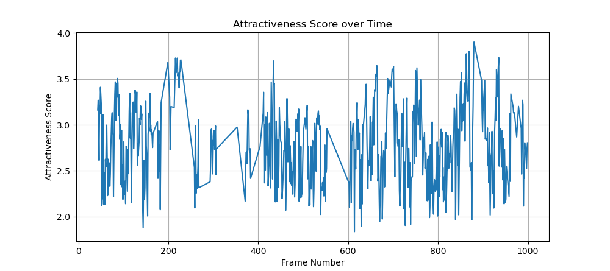

# Facial-Attraction-Live-Analysis
This repository contains a neural network application based on the SCUT-FBP5500 pretrained models,  aims to calculate facial attractiveness from a sequence of face images. The objective is to track and visualize the fluctuations of facial attractiveness during a live broadcast, identifying patterns and potential impacts on management.

## 问题描述

1. 阅读本周资料。

2. 根据1中的相关定义和理论，利用SCUT-FBP5500（https://github.com/HCIILAB/SCUT-FBP5500-Database-Release）公开的神经网络代码和模型权重，对提供的face_seq.zip的人脸进行面孔吸引力计算。假设图片的文件名为帧序号（虽不连续，但大小能够表征时间先后），请以得到的吸引力为y，连续化后的序号为x（从小到大，从0开始重新编号），观察直播过程中吸引力的波动情形。

3. 思考2中所得的曲线，对直播有何管理的实践意义？如有，请简单讨论并结合2中的例子给出具体计算与展示。

## 思路分析

首先，根据给定的训练代码，定义自定义的ResNet模型及其构成模块。

- **conv3x3**: 定义了一个3x3卷积层，带有padding和stride。
- **BasicBlock**: 定义了ResNet的基本模块，包括两层卷积层及其后续的批标准化和ReLU激活。
- **ResNet**: 使用BasicBlock构建了ResNet模型，包括初始卷积层、各层的模块堆叠、全局平均池化层和全连接层。

其次，加载加载预训练的模型

- **加载模型路径和图像目录路径**: 定义模型权重的路径和待处理图像的目录路径。
- **定义图像预处理步骤**: 使用`torchvision.transforms`定义图像的预处理步骤，包括调整大小、转为tensor、以及标准化处理。

加载自定义模型和权重

- **实例化模型**: 根据定义的ResNet类实例化模型。
- **加载检查点文件**: 使用`torch.load`加载模型权重文件，同时指定`map_location`为`cpu`，以确保在没有GPU的环境下能够正常运行。
- **调整权重字典的键**: 去除权重字典中键的`module.`前缀（如果存在），以匹配模型的键。
- **加载模型权重**: 使用调整后的权重字典加载模型的权重。

定义图像处理函数：定义一个函数`process_image`，该函数接受图像路径作为输入，执行以下步骤：

- 打开图像并转换为RGB模式。
- 应用之前定义的预处理步骤。
- 添加batch维度。
- 使用模型进行前向传播，获取输出的吸引力得分。

处理图像并保存结果：

- **初始化结果列表**: 用于存储每张图像的文件名和对应的吸引力得分。
- **遍历图像目录**: 对每个图像文件进行处理，计算其吸引力得分，并将结果存储到结果列表中。
- **保存结果到CSV文件**: 将结果写入CSV文件中，包含两列：文件名和吸引力得分。

## 代码实现

```python
import os
import csv
import torch
import torchvision.transforms as transforms
from PIL import Image
import math
from collections import OrderedDict
import torch.nn as nn

# Custom ResNet class based on provided training script
def conv3x3(in_planes, out_planes, stride=1):
    return nn.Conv2d(in_planes, out_planes, kernel_size=3, stride=stride, padding=1, bias=False)

class BasicBlock(nn.Module):
    expansion = 1
    def __init__(self, inplanes, planes, stride=1, downsample=None):
        super(BasicBlock, self).__init__()
        m = OrderedDict()
        m['conv1'] = conv3x3(inplanes, planes, stride)
        m['bn1'] = nn.BatchNorm2d(planes)
        m['relu1'] = nn.ReLU(inplace=True)
        m['conv2'] = conv3x3(planes, planes)
        m['bn2'] = nn.BatchNorm2d(planes)
        self.group1 = nn.Sequential(m)
        self.relu = nn.Sequential(nn.ReLU(inplace=True))
        self.downsample = downsample

    def forward(self, x):
        if self.downsample is not None:
            residual = self.downsample(x)
        else:
            residual = x
        out = self.group1(x) + residual
        out = self.relu(out)
        return out

class ResNet(nn.Module):
    def __init__(self, block, layers, num_classes=1):
        self.inplanes = 64
        super(ResNet, self).__init__()
        m = OrderedDict()
        m['conv1'] = nn.Conv2d(3, 64, kernel_size=7, stride=2, padding=3, bias=False)
        m['bn1'] = nn.BatchNorm2d(64)
        m['relu1'] = nn.ReLU(inplace=True)
        m['maxpool'] = nn.MaxPool2d(kernel_size=3, stride=2, padding=1)
        self.group1 = nn.Sequential(m)
        self.layer1 = self._make_layer(block, 64, layers[0])
        self.layer2 = self._make_layer(block, 128, layers[1], stride=2)
        self.layer3 = self._make_layer(block, 256, layers[2], stride=2)
        self.layer4 = self._make_layer(block, 512, layers[3], stride=2)
        self.avgpool = nn.Sequential(nn.AvgPool2d(7))
        self.group2 = nn.Sequential(
            OrderedDict([
                ('fullyconnected', nn.Linear(512 * block.expansion, num_classes))
            ])
        )
        for m in self.modules():
            if isinstance(m, nn.Conv2d):
                n = m.kernel_size[0] * m.kernel_size[1] * m.out_channels
                m.weight.data.normal_(0, math.sqrt(2. / n))
            elif isinstance(m, nn.BatchNorm2d):
                m.weight.data.fill_(1)
                m.bias.data.zero_()
            elif isinstance(m, nn.Linear):
                torch.nn.init.xavier_uniform_(m.weight.data)
                torch.nn.init.constant_(m.bias.data, 0)

    def _make_layer(self, block, planes, blocks, stride=1):
        downsample = None
        if stride != 1 or self.inplanes != planes * block.expansion:
            downsample = nn.Sequential(
                nn.Conv2d(self.inplanes, planes * block.expansion, kernel_size=1, stride=stride, bias=False),
                nn.BatchNorm2d(planes * block.expansion),
            )
        layers = []
        layers.append(block(self.inplanes, planes, stride, downsample))
        self.inplanes = planes * block.expansion
        for i in range(1, blocks):
            layers.append(block(self.inplanes, planes))
        return nn.Sequential(*layers)

    def forward(self, x):
        x = self.group1(x)
        x = self.layer1(x)
        x = self.layer2(x)
        x = self.layer3(x)
        x = self.layer4(x)
        x = self.avgpool(x)
        x = x.view(x.size(0), -1)
        x = self.group2(x)
        return x

# Define the path to the model and the images
model_path = './pytorch-models/resnet18.pth'
image_dir = './face_seq'

# Define the transform to be applied to the images
transform = transforms.Compose([
    transforms.Resize((224, 224)),
    transforms.ToTensor(),
    transforms.Normalize(mean=[0.485, 0.456, 0.406], std=[0.229, 0.224, 0.225]),
])

# Load the custom model
model = ResNet(BasicBlock, [2, 2, 2, 2], num_classes=1)

# Load the checkpoint
checkpoint = torch.load(model_path, map_location=torch.device('cpu'), encoding='latin1')
state_dict = checkpoint['state_dict']

# Adjust the keys in state_dict if necessary
new_state_dict = {}
for k, v in state_dict.items():
    if k.startswith('module.'):
        new_state_dict[k[7:]] = v  # Remove 'module.' prefix
    else:
        new_state_dict[k] = v

# Load the state dict into the model
model.load_state_dict(new_state_dict)
model.eval()

# Function to process a single image and get the model's output
def process_image(image_path):
    image = Image.open(image_path).convert('RGB')
    image = transform(image)
    image = image.unsqueeze(0)  # Add batch dimension
    with torch.no_grad():
        output = model(image)
    return output.item()

# List to store the results
results = []

# Process each image in the directory
for filename in os.listdir(image_dir):
    if filename.endswith('.jpg') or filename.endswith('.png'):
        image_path = os.path.join(image_dir, filename)
        attractiveness_score = process_image(image_path)
        results.append([filename, attractiveness_score])

# Save the results to a CSV file
output_csv = 'attractiveness_scores.csv'
with open(output_csv, mode='w', newline='') as file:
    writer = csv.writer(file)
    writer.writerow(['filename', 'attractiveness_score'])
    writer.writerows(results)

print(f"Results saved to {output_csv}")

```

## 结果与讨论



横轴表示帧序号，纵轴表示吸引力得分。可以观察到吸引力得分在直播过程中有明显的波动，有时高，有时低。这种波动可能是由于多种因素引起的，例如主播的表情变化、光线变化、摄像头角度变化等。

根据所得的吸引力波动曲线，可以提出以下几点对直播管理的实践意义：

1. **实时反馈机制**：通过实时监测和计算主播的吸引力得分，可以为主播提供即时反馈，帮助他们调整自己的表情和姿态，以维持较高的吸引力得分。这种实时反馈机制可以提高观众的观看体验，从而增加直播的受欢迎程度。
2. **优化直播环境**：吸引力得分的波动可能受到环境因素的影响，例如光线、摄像头角度等。通过分析吸引力得分的波动情况，可以识别和优化这些环境因素，例如调整光线照明、摄像头位置等，以保持稳定的高吸引力得分。
3. **观众互动策略**：吸引力得分的波动可以帮助制定观众互动策略。例如，当吸引力得分较低时，可以通过增加与观众的互动来提升直播的吸引力。反之，当吸引力得分较高时，可以集中展示主播的特长或才艺，进一步提升直播的效果。
4. **数据驱动的内容调整**：通过分析吸引力得分，可以识别哪些内容或行为会导致吸引力得分的显著变化，从而帮助主播和运营团队调整直播内容，避免低吸引力得分的行为，突出高吸引力得分的内容。

通过实时反馈、环境优化、观众互动策略和数据驱动的内容调整，可以有效提升直播的吸引力和观众满意度。
